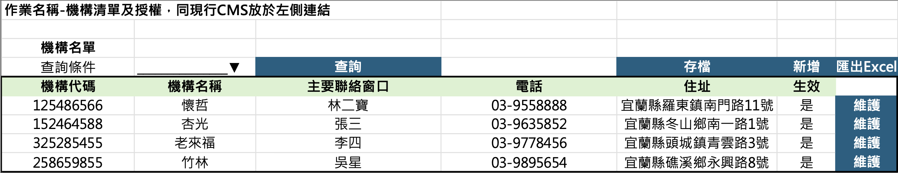
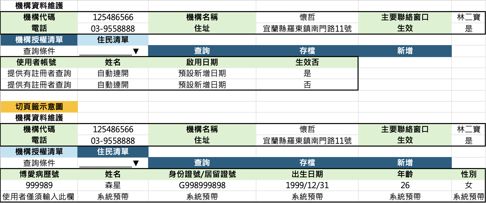
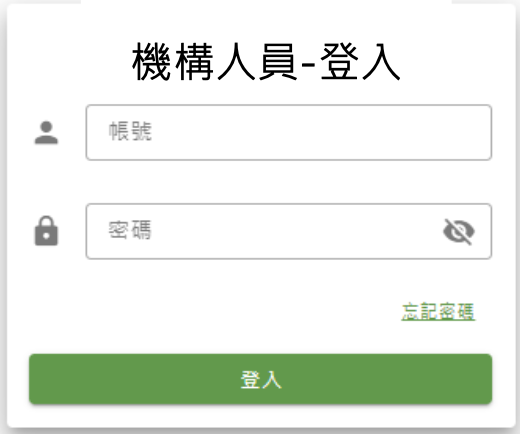
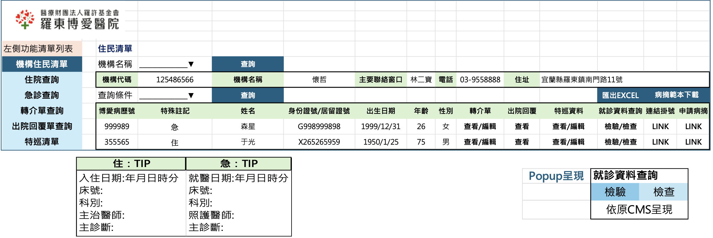
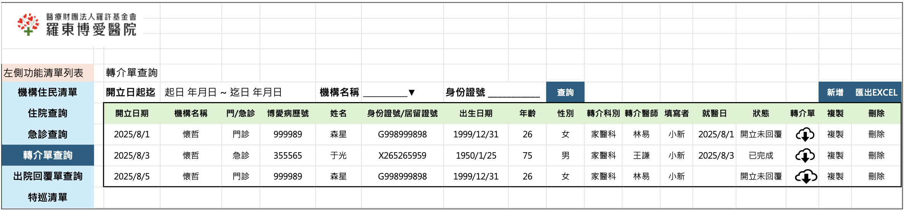
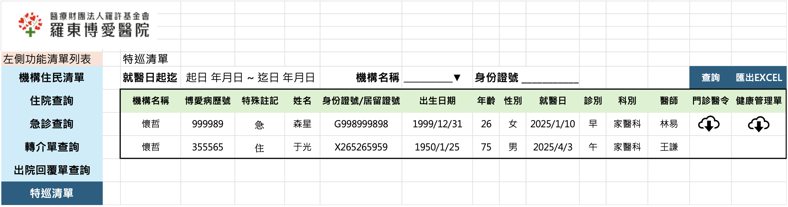
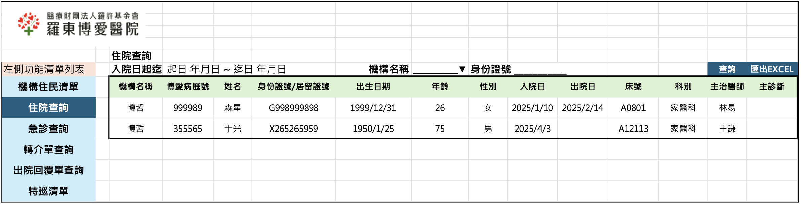
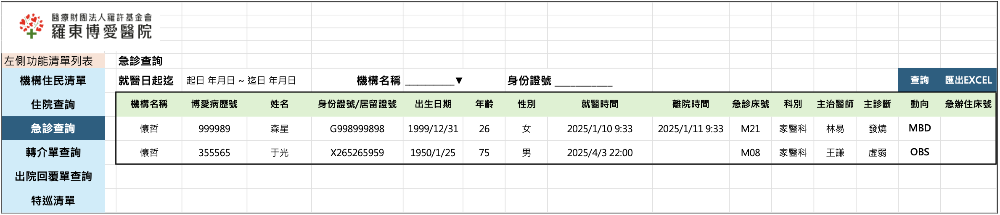

# 機構需求書 v2

## [cite_start]平台定義 [cite: 1]

* [cite_start]**APP:** Pohai 提供民眾註冊及使用的APP [cite: 2]
* [cite_start]**CMS:** WEB版本,提供 Pohai 員工使用之後台管理平台 [cite: 3]
* [cite_start]**機構 CMS:** WEB版本,提供機構人員使用之管理平台,與CMS功能須區分,當時馬在飛提出建議以另一入口登入作區隔以以功能權限設定降低開發成本。 [cite: 4]

---

## [cite_start]一、權限及授權 [cite: 5]

1. [cite_start]機構員工,由APP進行註冊帳號 [cite: 6]
2. [cite_start]博愛管理者由CMS進行授權 [cite: 7]

[cite_start]**作業名稱-機構清單及授權,同現行CMS放於左側連結** [cite: 8]

### [cite_start]機構名單 [cite: 8]

| 查詢條件 | | | | | | |
| :--- | :--- | :--- | :--- | :--- | :--- | :--- |
| **機構代碼** | **機構名稱** | **主要聯絡窗口** | **電話** | **住址** | **生效** | |
| 125486566 | 懷哲 | 林二寶 | 03-9558888 | 宜蘭縣羅東鎮南門路11號 | 是 | 維護 |
| 152464588 | 杏光 | 張三 | 03-9635852 | 宜蘭縣冬山鄉南一路1號 | 是 | 維護 |
| 325285455 | 老來福 | 李四 | 03-9778456 | 宜蘭縣頭城鎮青雲路3號 | 是 | 維護 |
| 258659855 | 竹林 | 吳星 | 03-9895654 | 宜蘭縣礁溪鄉永興路8號 | 是 | 維護 |

[cite_start]**畫面規則:** [cite: 10]

* [cite_start]**新增:** 系統直接新增一列,填寫完按「存檔」完成 [cite: 11]
* [cite_start]**修改:** 於畫面直接修改資料,完成按「存檔」完成 [cite: 12]
* [cite_start]按下維護按鈕畫面如下 [cite: 13]

---

### [cite_start]機構資料維護 [cite: 14]

| | | | | | |
| :--- | :--- | :--- | :--- | :--- | :--- |
| **機構代碼** | 125486566 | **機構名稱** | 懷哲 | **主要聯絡窗口** | 林二寶 |
| **電話** | 03-9558888 | **住址** | 宜蘭縣羅東鎮南門路11號 | **生效** | 是 |

[cite_start]*(切頁籤示意圖)* [cite: 16]

### [cite_start]機構授權清單 [cite: 15]

| 查詢條件 | | | |
| :--- | :--- | :--- | :--- |
| **使用者帳號** | **姓名** | **啟用日期** | **生效否** |
| 提供有註冊者查詢 | 自動帶出 | 預設新增日期 | 是 |
| 提供有註冊者查詢 | 自動帶出 | 預設新增日期 | 否 |

### [cite_start]住民清單 [cite: 22]

| 博愛病歷號 | 姓名 | 身份證號/居留證號 | 出生日期 | 年齡 | 性別 |
| :--- | :--- | :--- | :--- | :--- | :--- |
| 999989 | 森星 | G998999898 | 1999/12/31 | 26 | 女 |
| *使用者僅須輸入此欄* | *系統預帶* | *系統預帶* | *系統預帶* | *系統預帶* | *系統預帶* |

[cite_start]**畫面規則:** [cite: 21]

* [cite_start]機構資料呈現於上方,下方兩個頁面(機構授權清單、住民清單)可切換新增/修改存檔 [cite: 27]
* [cite_start]**新增:** 系統直接新增一列,填寫完按「存檔」完成 [cite: 28]
* [cite_start]**修改:** 於畫面直接修改資料,完成按「存檔」完成 [cite: 29]
* [cite_start]**機構授權清單:** 主要於CMS維護,新增/存檔時透過API進行CMS與HIS同步,以CMS為主。 [cite: 30]
* [cite_start]**住民清單:** 主要透過API串接,由HIS提供,但CMS畫面仍可自行修改,若修改需寫回HIS,兩邊API需可雙向同步資料。若不一致時資料以HIS為主。 [cite: 31]

---

## [cite_start]二、登入-機構CMS系統及功能需求 [cite: 33]

### 登入畫面

[cite_start]*(圖片參考: `images/image_3.png`)* [cite: 35]

### [cite_start]機構住民清單 [cite: 59]

[cite_start]**上方資訊** [cite: 60]

* [cite_start]**機構名稱:** (下拉選單) 懷哲 [cite: 65]
* [cite_start]**機構代碼:** 125486566 [cite: 63]
* [cite_start]**主要聯絡窗口:** 林二寶 [cite: 66]
* [cite_start]**電話:** 03-9558888 [cite: 66]
* [cite_start]**住址:** 宜蘭縣羅東鎮南門路11號 [cite: 66]

[cite_start]**住民列表** [cite: 58]

| 博愛病歷號 | 特殊註記 | 姓名 | 身份證號/居留證號 | 出生日期 | 年齡 | 性別 | 轉介單 | 出院回覆 | 特巡資料 | 就診資料查詢 | 申請病摘 | 連結掛號 |
| :--- | :--- | :--- | :--- | :--- | :--- | :--- | :--- | :--- | :--- | :--- | :--- | :--- |
| 999989 | 急 | 森星 | G998999898 | 1999/12/31 | 26 | 女 | 查看/編輯 | 查看 | 查看/編輯 | 檢驗/檢查 | LINK | LINK |
| 355565 | 住 | 于光 | X265265959 | 1950/1/25 | 75 | 男 | 查看/編輯 | 查看 | 查看/編輯 | 檢驗/檢查 | LINK | LINK |

[cite_start]**特殊註記 TIP 資訊** [cite: 67]

| 住:TIP | 急:TIP |
| :--- | :--- |
| 入住日期: 年月日時分 | 就醫日期: 年月日時分 |
| 床號: | 床號: |
| 科別: | 科別: |
| 主治醫師: | 照護醫師: |
| 主診斷: | 主診斷: |

[cite_start]**就診資料查詢 Popup** [cite: 68]

* 檢驗/檢查 (依原CMS呈現)

[cite_start]**畫面規則:** [cite: 37]

1. [cite_start]一位人員可能有負責多家機構,故提供下拉選單但須進行預設其一,並預設帶出一筆機構的資料 [cite: 38]
2. [cite_start]特殊註記,呈現「急」、「住」,代表該病患正在醫院就診中,並於滑鼠移過,提供對應資訊呈現。
   機構CMS透過API與HIS串接,CMS僅需以API欄位呈現「急」、「住」,是否需呈現則由HIS端依以下規則判定 [cite: 39]
    * [cite_start]如來本院掛急診,一辦完掛號手續,就會出現 [cite: 40]
    * [cite_start]如來本院住院,一入住病房(有掛到床號),就會出現 [cite: 41]
    * [cite_start]點選急或住,就會出現完整訊息 [cite: 42]
    * [cite_start]若急診辦理住院,(有掛到床號)訊息就會變成 "住" [cite: 43]
    * [cite_start]若住院辦理離院(關帳)手續,即時動態就會消失。 [cite: 44]
3. [cite_start]其他細功能 [cite: 48]
    * [cite_start]**轉介單:** 另詳述 [cite: 49]
    * [cite_start]**出院回覆:** 另詳述 [cite: 50]
    * [cite_start]**特巡資料:** 另詳述,link特巡清單畫面並增加預帶入該住民身份證號 [cite: 51]
    * [cite_start]**就診資料查詢:** 進行查詢檢驗/檢查資料,使用CMS檢查紀錄及檢驗紀錄功能提供POPUP 分頁查詢 [cite: 52]
    * [cite_start]**連結掛號:** `https://www.pohai.org.tw/register.php#sidebar_1` [cite: 53]
    * [cite_start]**申請病摘:** 預計連到博愛官網連結,但目的地功能未完成,尚無法提供連結 [cite: 54]
    * [cite_start]**病摘範本下載:** `https://www.pohai.org.tw/Upload/202007/file_202007220906471.pdf` [cite: 55]

---

### [cite_start]轉介單查詢 [cite: 72]

| 開立日期 | 機構名稱 | 門/急診 | 博愛病歷號 | 姓名 | 身份證號/居留證號 | 出生日期 | 年齡 | 性別 | 轉介科別 | 轉介醫師 | 填寫者/就醫日 | 狀態 | 轉介單 | 複製 | 刪除 |
| :--- | :--- | :--- | :--- | :--- | :--- | :--- | :--- | :--- | :--- | :--- | :--- | :--- | :--- | :--- | :--- |
| 2025/8/1 | 懷哲 | 門診 | 999989 | 森星 | G998999898 | 1999/12/31 | 26 | 女 | 家醫科 | 林易 | 小新 / 2025/8/1 | 開立未回覆 | | 複製 | 刪除 |
| 2025/8/3 | 懷哲 | 急診 | 355565 | 于光 | X265265959 | 1950/1/25 | 75 | 男 | 家醫科 | 王謙 | 小新 / 2025/8/3 | 已完成 | | 複製 | 刪除 |
| 2025/8/5 | 懷哲 | 門診 | 999989 | 森星 | G998999898 | 1999/12/31 | 26 | 女 | 家醫科 | 林易 | 小新 | 開立未回覆 | | 複製 | 刪除 |

[cite_start]**畫面規則:** [cite: 73]

1. [cite_start]**清單:** 透過API跟博愛取得資料 [cite: 74]
    * [cite_start]**查詢條件:** [cite: 75]
        * [cite_start]開立日期起迄: 預設一個月,為必填 [cite: 76]
        * [cite_start]使用者帳號: 登入者 [cite: 77]
        * [cite_start]機構名稱: 可空白 [cite: 78]
        * [cite_start]身份證號: 預設空白;若由住民清單導入,則預帶該住民身份證號 [cite: 79]
    * [cite_start]**博愛條件:** API需回傳是否已就醫、回覆單是否已完成,並回傳PDF。 [cite: 80]
2. [cite_start]**轉介單:** 博愛提供API回傳PDF,開立未回覆/完成回覆皆為同一張報表。 [cite: 81]
3. [cite_start]**新增:** 導入新增轉介單模式 [cite: 81]
4. [cite_start]**複製:** 依點擊的資料複製開啟新增模式,並帶入或清空資料。 [cite: 82]
5. [cite_start]**匯出:** 可依查詢清單匯出EXCEL [cite: 83]
6. [cite_start]**刪除:** 狀態未完成且無就醫日期,可進行刪除。 [cite: 84]

---

### 新增/編輯轉介單

* [cite_start]**看診別:** 口門診 口急診 [cite: 85, 86]
* [cite_start]**看診日期:** 急診自動帶入當日,門診由機構輸入 [cite: 87]
* [cite_start]**看診科別:** (自輸) [cite: 89]
* [cite_start]**醫師:** (帶入) [cite: 90]
* [cite_start]**診間號:** (帶入) [cite: 91]
* [cite_start]**時段:** (帶入) [cite: 92]

[cite_start]**一、基本資料** [cite: 94]

* [cite_start]**病患身份證號:** 自動帶入/帶入後比對該機構住民後查詢HIS基本資料帶回 [cite: 95]
* [cite_start]**姓名:** (帶入) [cite: 97]
* [cite_start]**性別:** (帶入) [cite: 99]
* [cite_start]**生日:** (帶入) [cite: 101]
* [cite_start]**年齡:** (帶入) [cite: 103]
* [cite_start]**病歷號:** (帶入) [cite: 105]
* [cite_start]**身高/體重:** [cite: 106, 107]
* [cite_start]**緊急聯絡人/電話:** [cite: 108, 109]
* [cite_start]**過敏史:** 口無 口有 (口食物 口輸血 口藥物: ... 口其他: ...) [cite: 110, 111, 112, 113, 114]
* [cite_start]**疾病史:** 口無 口有 (HTN, DM, 心臟病, TB, 疥瘡, 其他) [cite: 116, 119, 120, 121]
* [cite_start]**手術史:** 口無 口有: ... [cite: 117]
* [cite_start]**肢體禁治療:** 口無 口有 (右手, 左手, 右腳, 左腳, 其他) [cite: 122]
* [cite_start]**特殊事項:** 口無 口B肝, HIV, open TB, 疥瘡, 其他 [cite: 127, 128, 129, 130]

[cite_start]**二、請提供與疾病相關治療之情形** [cite: 132]

* [cite_start]**生命徵象:** 體溫, 脈搏, 呼吸, 血壓, 血氧(SpO2) [cite: 133, 135, 137]
* [cite_start]**意識:** 清醒, 淡漠, 混亂, 木僵, 昏迷, 反應遲鈍, 嗜睡 [cite: 138, 139]
* [cite_start]**皮膚完整性:** 正常, 壓瘡, IAD, PAOD, 外傷, 已縫合的傷口, 其他 [cite: 140, 142]
* [cite_start]**特殊管路:** 口無 口人工血管(Port-A), Double-J, PVC, PICC, 傷口引流管, 其他 [cite: 131, 134, 136]
* [cite_start]**留置管路:** NG, Foley, Trachea 등 [cite: 147, 152, 153, 154]
* [cite_start]**用氧:** 口無, Nasal cannula, T-piece, 其他 [cite: 156, 158]

[cite_start]**三、交班事項(病情說明)** [cite: 162]

* [cite_start]**就診原因:** 常規看診, 預排手術, 療程, 復健, 開立身障或重大, 其他急性症狀... [cite: 163, 165, 166, 167, 168, 169]
* [cite_start]**機構就診前先行處理部份:** 口無 口有: ... [cite: 170]

[cite_start]**四、目前用藥** [cite: 171]

* [cite_start]自行填寫 & 也需要可以使用圖片檔。 [cite: 172]

[cite_start]**五、補述說明** [cite: 173]

* [cite_start]自行填寫 & 也需要可以使用圖片檔或夾帶PDF檔。 [cite: 174]

---

### [cite_start]出院回覆單查詢 [cite: 177]

| 機構名稱 | 博愛病歷號 | 姓名 | 身份證號/居留證號 | 出生日期 | 年齡 | 性別 | 入院日 | 出院日 | 床號 | 科別 | 主治醫師 | 出院回覆單 |
| :--- | :--- | :--- | :--- | :--- | :--- | :--- | :--- | :--- | :--- | :--- | :--- | :--- |
| 懷哲 | 999989 | 森星 | G998999898 | 1999/12/31 | 26 | 女 | 2025/1/10 | 2025/2/14 | A0801 | 家醫科 | 林易 | (下載圖示) |
| 懷哲 | 355565 | 于光 | X265265959 | 1950/1/25 | 75 | 男 | 2025/4/3 | | A12113 | 家醫科 | 王謙 | (下載圖示) |

[cite_start]**畫面規則:** [cite: 178]

1. [cite_start]**清單:** 透過API跟博愛取得資料 [cite: 179]
    * [cite_start]**查詢條件:** [cite: 180]
        * [cite_start]入院日起迄: 預設一個月, 為必填 [cite: 181]
        * [cite_start]使用者帳號: 登入者 [cite: 182]
        * [cite_start]機構名稱: 可空白 [cite: 183]
        * [cite_start]身份證號: 預設空白;若由住民清單導入,則預帶該住民身份證號 [cite: 184]
    * [cite_start]**博愛條件:** API需回傳是否有「出院回覆單」可下載之狀態。 [cite: 185]
2. [cite_start]**出院回覆單:** 博愛提供API回傳PDF,有完成看診有資料才提供呈現可下載圖示。 [cite: 186]

---

### [cite_start]特巡清單 [cite: 188]

| 機構名稱 | 博愛病歷號 | 特殊註記 | 姓名 | 身份證號/居留證號 | 出生日期 | 年齡 | 性別 | 就醫日 | 診別 | 科別 | 醫師 | 門診醫令 | 健康管理單 |
| :--- | :--- | :--- | :--- | :--- | :--- | :--- | :--- | :--- | :--- | :--- | :--- | :--- | :--- |
| 懷哲 | 999989 | 急 | 森星 | G998999898 | 1999/12/31 | 26 | 女 | 2025/1/10 | 早 | 家醫科 | 林易 | (下載圖示) | (下載圖示) |
| 懷哲 | 355565 | 住 | 于光 | X265265959 | 1950/1/25 | 75 | 男 | 2025/4/3 | 午 | 家醫科 | 王謙 | (下載圖示) | (下載圖示) |

[cite_start]**畫面規則:** [cite: 189]

1. [cite_start]**清單:** 透過API跟博愛取得資料(就醫E5診) [cite: 190]
    * [cite_start]**查詢條件:** [cite: 191]
        * [cite_start]就醫日起迄: 預設一個月, 為必填 [cite: 192]
        * [cite_start]使用者帳號: 登入者 [cite: 193]
        * [cite_start]機構名稱: 可空白 [cite: 194]
        * [cite_start]身份證號: 預設空白;若由住民清單導入,則預帶該住民身份證號 [cite: 195]
    * [cite_start]**博愛條件:** API需回傳是否有門診醫令、健康管理單可下載之狀態。 [cite: 196]
2. [cite_start]**門診醫令:** 博愛提供API回傳PDF,有完成看診有資料才提供呈現可下載圖示。 [cite: 197]
3. [cite_start]**健康管理單:** 博愛提供API回傳PDF,有完成看診並且有資料可下載才提供呈現可下載圖示。 [cite: 198]

---

### [cite_start]住院查詢 [cite: 199]

| 機構名稱 | 博愛病歷號 | 姓名 | 身份證號/居留證號 | 出生日期 | 年齡 | 性別 | 入院日 | 出院日 | 床號 | 科別 | 主治醫師 |
| :--- | :--- | :--- | :--- | :--- | :--- | :--- | :--- | :--- | :--- | :--- | :--- |
| 懷哲 | 999989 | 森星 | G998999898 | 1999/12/31 | 26 | 女 | 2025/1/10 | 2025/2/14 | A0801 | 家醫科 | 林易 |
| 懷哲 | 355565 | 于光 | X265265959 | 1950/1/25 | 75 | 男 | 2025/4/3 | | A12113 | 家醫科 | 王謙 |

[cite_start]**畫面規則:** [cite: 201]

1. [cite_start]**清單:** 透過API跟博愛取得資料 [cite: 202]
2. [cite_start]**查詢條件:** [cite: 203]
    * [cite_start]入院日起迄: 預設一個月, 為必填 [cite: 204]
    * [cite_start]使用者帳號: 登入者 [cite: 205]
    * [cite_start]機構名稱: 可空白 [cite: 206]

---

### [cite_start]急診查詢 [cite: 210]

| 機構名稱 | 博愛病歷號 | 姓名 | 身份證號/居留證號 | 出生日期 | 年齡 | 性別 | 就醫時間 | 離院時間 | 急診床號 | 科別 | 主治醫師 | 主診斷 | 動向 | 急辦住床號 |
| :--- | :--- | :--- | :--- | :--- | :--- | :--- | :--- | :--- | :--- | :--- | :--- | :--- | :--- | :--- |
| 懷哲 | 999989 | 森星 | G998999898 | 1999/12/31 | 26 | 女 | 2025/1/10 9:33 | 2025/1/11 9:33 | M21 | 家醫科 | 林易 | 發燒 | MBD | |
| 懷哲 | 355565 | 于光 | X265265959 | 1950/1/25 | 75 | 男 | 2025/4/3 22:00| | M08 | 家醫科 | 王謙 | 虛弱 | OBS | |

[cite_start]**畫面規則:** [cite: 212]

1. [cite_start]**清單:** 透過API跟博愛取得資料 [cite: 213]
2. [cite_start]**查詢條件:** [cite: 214]
    * [cite_start]急診就醫起迄: 預設一個月, 為必填 [cite: 215]
    * [cite_start]使用者帳號: 登入者 [cite: 216]
    * [cite_start]機構名稱: 可空白 [cite: 217]
