# 羅東博愛醫院＿APP專案委託製作內容確認書

## 目錄

1. [簡介](#1-簡介)
   1. [功能需求概述](#11-功能需求概述)
   2. [環境需求](#12-環境需求)
   3. [驗收標準](#13-驗收標準)
   4. [相容性版本](#14-相容性版本)
   5. [測試計畫](#15-測試計畫)

2. [角色與身份說明](#2-角色與身份說明)

3. [各功能與子功能說明](#3-各功能與子功能說明)
   1. [APP 前台功能](#31-app-前台功能)
      1. [登入註冊（一階）](#311-登入註冊一階)
      2. [Dashboard首頁（一階）](#312-dashboard首頁一階)
      3. [通知中心（第二階段）](#313-通知中心第二階段)
      4. [體態管理](#314-體態管理)
      5. [課程預約（第五階段）](#315-課程預約第五階段)
      6. [推播設定（第二階段）](#316-推播設定第二階段)
      7. [問卷（第二階段）](#317-問卷第二階段)
      8. [健康資訊](#318-健康資訊)
      9. [家戶設定（第四階段）](#319-家戶設定第四階段)
      10. [運動觀測（第三階段）](#3110-運動觀測第三階段)
      11. [聊天室（第二階段）](#3111-聊天室第二階段)
      12. [衛教園地（第四階段）](#3112-衛教園地第四階段)
   2. [CMS 後台功能](#32-cms-後台功能)
      1. [登入（第二階段）](#321-登入第二階段)
      2. [會員管理（第一階段）](#322-會員管理第一階段)
      3. [醫事人員管理（第二階段）](#323-醫事人員管理第二階段)
      4. [群組管理（第一階段）](#324-群組管理第一階段)
      5. [課程管理（第五階段）](#325-課程管理第五階段)
      6. [衛教園地管理](#326-衛教園地管理)
      7. [個案清單](#327-個案清單)
      8. [個人主頁](#328-個人主頁)
      9. [聊天室管理（第二階段）](#329-聊天室管理第二階段)
      10. [問卷管理（第二階段）](#3210-問卷管理第二階段)
      11. [推播管理（第二階段）](#3211-推播管理第二階段)
      12. [運動觀測管理（第三階段）](#3212-運動觀測管理第三階段)

4. [PRD 異動記錄](#4-prd-異動記錄)

## 1. 簡介

### 1.1 功能需求概述

#### 系統簡述

- 語言需求：繁體中文（如需做多語系架構，需額外加價）

- 畫面需求：APP和網頁

### 1.2 環境需求

此次專案建置於馬在飛網域，正式主機環境以及子網域由馬在飛準備。詳細服務內容依據追加項目及雲端建置合約為準

#### Web 開發語言與資料庫版本

- 前台架構：Flutter

- 後台架構：React、Node.js框架

#### 硬體環境規格

- 測試機環境：馬在飛負責建置測試環境伺服器進行開發

- 正式機環境：馬在飛負責建置正式環境伺服器

### 1.3 驗收標準

#### 交付物

- 可執行程式檔案供羅東博愛醫院測試

- 羅東博愛醫院 系統前台 - APP

- 羅東博愛醫院 系統前台 - 網頁

- 羅東博愛醫院 系統後台 - 網頁

- 文件專案委託製作內容確認書

### 1.4 相容性版本

- 最高支援作業系統版本為交付測試30天前原廠發佈之版本

- 支援 Android6.0 以上、iOS11 以上系統

- 支援 Windows7以上與MacOS10.6以上之作業系統版本

- 支援 Chrome 78 以上與 Safari 23 以上之瀏覽器版本

### 1.5 測試計畫

#### 測試標準

- 測試是否符合本文件UI標準

- 檢核依據本文件說明之操作流程是否能取得預期結果

- 檢核相關提示與錯誤訊息是否正確顯示

#### APP和CMS測試

羅東博愛醫院於馬在飛提供交付測試執行程式檔後五個工作日內，依據本文件內容、功能需求描述、規格等，進行測試驗收。若交付程式檔含有bug，羅東博愛醫院須以書面方式要求馬在飛改正。

#### 修正項目書面樣式範例

| No. | 內容說明 | 平台 | 類型 | 提出日期 | 備註 | 馬在飛回覆 |
|-----|----------|------|------|----------|------|------------|
| 1 | 註冊時，必填欄位未填沒有出現提示 | iOS | bug | 2023/11/15 | | |
| 2 | 更改icon顏色 | Android | 優化 | 2023/11/15 | 將於保固期進行修正 | |

以上欄位為必需條件，可是專案實際需求，增加欄位。

承上，如逾五個工作日未提出錯誤或修改意見，視為驗收完成。

專案測試期間，馬在飛僅針對Bug進行修復，其餘優化項目，馬在飛可於驗收完成進入保固後，合議協助修改部分項目。

#### Bug定義為

- 未按照本文件UI設計圖實作

- 未按照本文件列舉之商業邏輯及防呆機制實作

- 系統無回應、連結失效、呈現資料錯誤

- 其他本文件載明但未確實完成項目

#### 優化定義

任何未說明於本文件中的項目，包含但不限於畫面顏色、字行、部局、文案、操作流程、防呆機制、操作方式…等等變更，若超過範圍，得選擇使用尚未執行的功能點數替換。

## 2. 角色與身份說明

### APP使用者前台

- 使用者：一般民眾

### CMS 管理後台（由博愛醫院操作使用）

- 超級管理員：只有一組帳號，不可被刪除

- 管理員：包含個管師、社區護理師、護理長、營養師、活力學苑、資管人員、社區管理者

- 醫事人員：包含：藥師、護理師、機構護理師

## 3. 各功能與子功能說明

### 3.1 APP 前台功能

#### 3.1.1 登入註冊（一階）

##### 登入

###### 登入功能

使用者下載APP後，可點擊登入進到登入畫面

登入畫面包含：

- 「身分證字號」輸入欄位（身分證字號 = 登入帳號）
- 「密碼」輸入欄位  
- 「忘記密碼？」忘記密碼點擊後，可輸入email或手機，
  寄送email或sms連結，重新設定密碼
- 其他登入方式：可透過gmail或apple id

##### 註冊

###### 註冊功能

使用者點擊註冊，進入註冊畫面，分為四個步驟：

###### 步驟1：身份驗證

- 輸入身分證字號/居留證號/護照號碼
- HIS判斷是否為院內病患
- 身分證字號將作為登入帳號使用

###### 步驟2：基本資料

- 輸入姓名*、性別*、生日*、身高*、email
- 可綁定google/apple登入

###### 步驟3：帳號設定

- 輸入手機*（需OTP認證）
- 密碼*（英文與數字，至少6碼）

###### 步驟4：選填資料（可跳過）

- 輸入體重、腰圍（非必填）

#### 3.1.2 Dashboard首頁（一階）

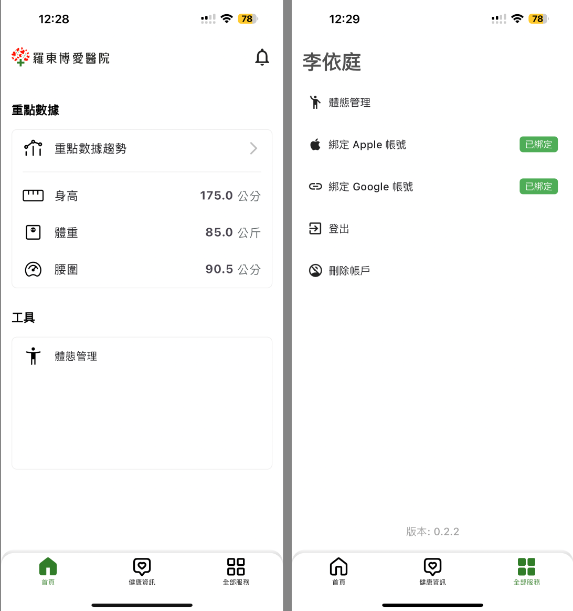

用戶註冊登入後，進入首頁dahsboard可點擊快捷按鈕

首頁畫面顯示：

- 通知（第二階段開發）

- 重點數據趨勢：顯示最近一次的自我監測數據紀錄

- 工具：包含體態管理、外部連結、問卷、其他

- tab bar：首頁、聊天室、衛教園地、健康資訊、全部服務

##### 健康資訊

- 自我監測/居家登錄 > （自我監測/數據圖表/總覽）

- 風險評估報告 >（HIS評估分數）

- 檢查/檢驗項目 > （檢查/檢驗項目）

- 就醫紀錄 >（就醫/手術/住院/用藥/繳費紀錄）

- 排程查詢 >（手術/檢查/慢性處方籤預約查詢）

##### 全部服務

- 體態管理

- 個人帳號設定

- 綁定apple/google帳號

- 登出

- 刪除帳號

#### 3.1.3 通知中心（第二階段）

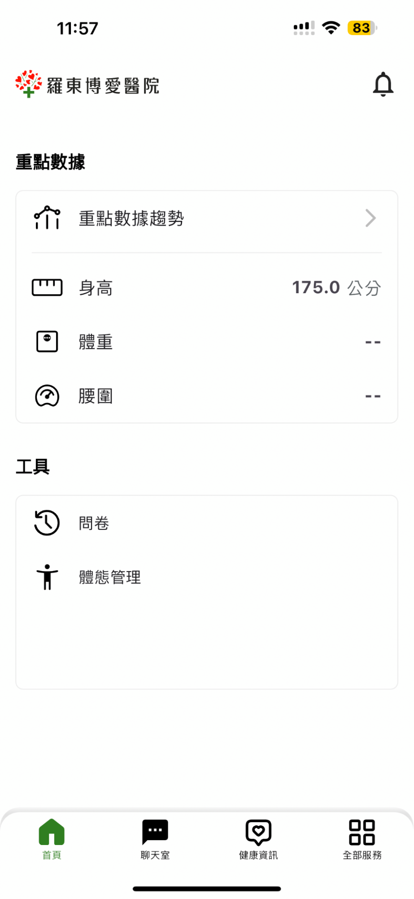

用戶可於通知中心點擊查看推播訊息
通知有以下類別，點擊後才算已讀：

- 文字推播

- 問卷推播

- 警示內容

#### 3.1.4 體態管理

##### 健康APP串接（第二階段）

使用者點擊允許，系統將讀取使用者iOS健康/ Google Fit資料

使用者於「自我監測」>「設定」> 「連接app與裝置」可點擊選擇希望連接的app與裝置（目前有ios健康及google fit）
點擊串接後，會向使用者詢問授權，使用者授權後即開始同步資料。當資料有不同步時，可點擊「立即同步」等待「上次同步時間」更新為當下時間即可。

##### 體態數據（一階）

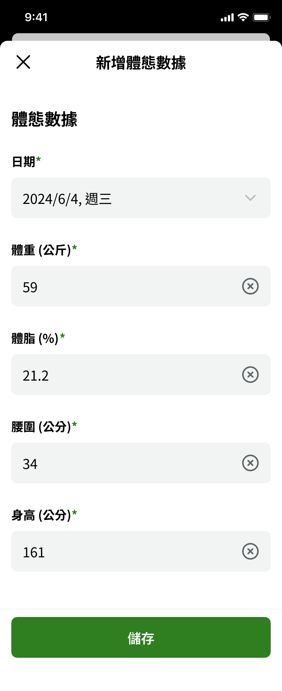

使用者進入體態數據，可新增、查看數據趨勢圖、新增數據

體態數據呈現：體重、體脂、腰圍
點擊新增數據：可填寫日期/時間（自動帶入當日日期）
若以有串接資訊/上次輸入資料/居家登錄填寫，將自動帶入
當勾選的時間範圍內，有數據時，則顯示3筆數據的數據趨勢變化圖

##### 飲食日誌（第一階段）

使用者可進入飲食日誌，紀錄個人飲食和生活重大事件

欄位包含：
新增數據（可選擇日誌、體態數據、生活重大事件）

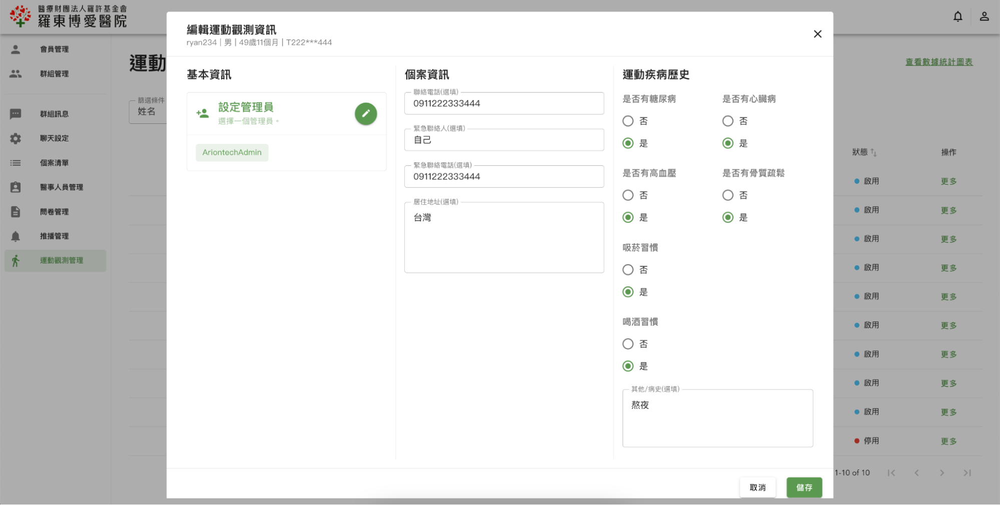

##### 新增日誌

- 日期下拉選擇（預設今日）

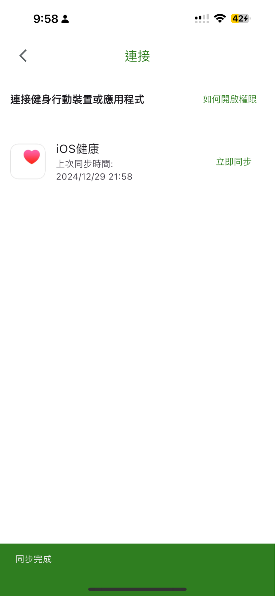

- 顯示當日總卡路里和六大類營養素份量加總

- 當日輸入的飲食紀錄：餐次（早餐、午餐、晚餐、點心、宵夜）

- 日期/時間

- 總卡路里：＿＿＿ 大卡

- 六大類份量：個別幾份

- 排序為：全穀雜糧、豆魚蛋肉、蔬菜、水果、乳品、油脂

- 其他熱量：＿＿＿大卡

- 餐食照片

- 餐食內容

##### 當日的生活重大事件

- 日期/時間

- 文字說明

- 醫事人員和用戶可針對日誌牆按讚留言

- 用戶可針對醫事人員的留言 回覆一次

##### 建立飲食紀錄

- 日期/時間 （預設當下）

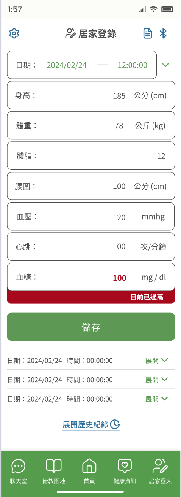

- 餐次可下拉選擇（（早餐、午餐、晚餐、點心、宵夜）

- 六大類份量

- 其他熱量

- 文字敘述

- 新增圖片（最多五張照片）

- 顯示固定文案：

##### 建立生活重大事件

- 日期/時間（預設當下）

- 文字說明

#### 3.1.5 課程預約（第五階段）

##### 課程瀏覽

使用者可於前台查看課程列表、檢視課程資訊、報名課程

課程列表，課程卡片包含：

- 課程圖片

- 課程名稱

- 授課時間

- 授課地點

- 授課老師

點擊檢視詳細課程內容，包含：

- 課程圖片

- 課程名稱

- 課程時間

- 課程地點

- 授課老師

- 課程金額

- 課程內容

點擊立即報名，可勾選票卷資訊，進入付款畫面。

##### 課程報名

使用者進入課程支付畫面進行支付

付款畫面欄位包含：

- 課程資訊

- 訂購人資訊

- 姓名（自動帶入）

- email（自動帶入）

- 手機（自動帶入）

- 優惠碼

- 推薦人

- 支付方式in app purchase

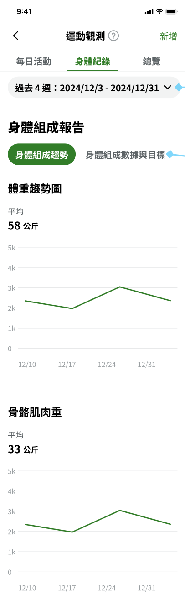

#### 3.1.6 推播設定（第二階段）

##### 推播設定

使用者可點擊推播管理，編輯是否個別推播設定

推播管理預設為全選，使用者點擊進入設定：可關閉
欄位包含以下，若使用者關閉則不會收到推播通知：

- 聊天室訊息

- 問卷提醒

- 異常數據 - 聊天室

- 異常數據 - 通知中心

- 就醫提醒（第四階段）

- 用藥提醒（第四階段）

- 衛教園地（第四階段）

#### 3.1.7 問卷（第二階段）

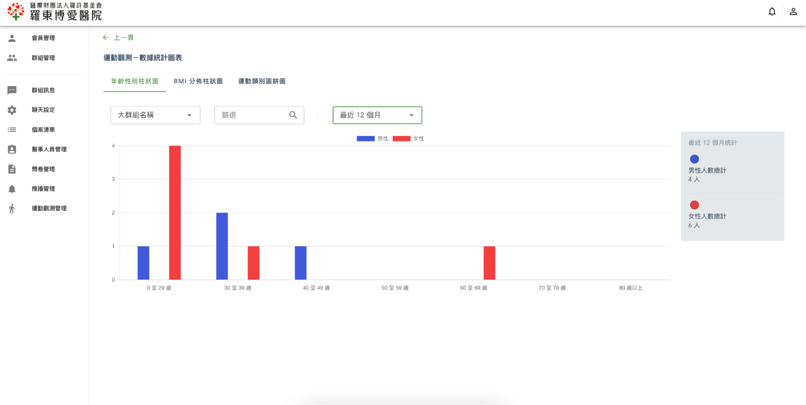

##### 問卷填寫

使用者可於接收到推播或是閱讀完衛教園地時填寫問卷

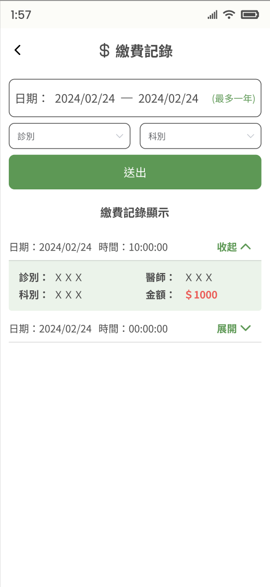

使用者可以透過兩種方式找到需要填寫的問卷：

- 首頁 > 工具 > 問卷

- 推播訊息 > 問卷通知 > 問卷

- 通知中心 > 問卷通知 > 問卷

問卷填寫完成後，於問卷列表將更新問卷填寫狀態，狀態分為三種：

- 未填寫：於截止日期前，使用者完成送出問卷

- 填寫完成：於截止日期前，使用者已完成送出問卷

- 逾時未填：截止日期到期時，使用者沒有填寫問卷

問卷列表：

- 填寫完成後，不可點擊問卷

- 尚未填寫但超過填寫日期/時間，不可點擊問卷

- 若希望編輯或填寫過期問卷，需聯繫個管師重新發送

使用者於閱讀完成衛教園地文章後，可點擊填寫問卷。（第四階段）
於問卷填答完畢後，系統將依照填答分數，回覆建議事項。（第五階段）

#### 3.1.8 健康資訊

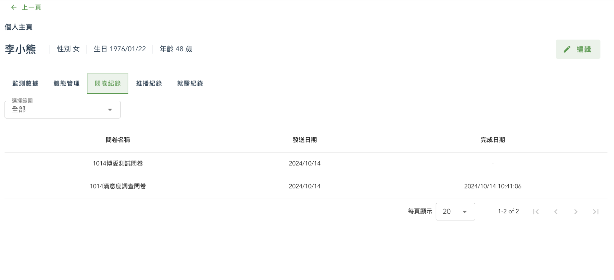

##### 自我監測/居家資料登錄（一階）

用戶可於自我監測進行數據監測和登錄，系統將根據設定閾值，當數據超過閾值時跳出紅色警示並自動發送訊息到聊天室通知個管師

##### 監測項目

- 身高*

- 體重*

- BMI（自動計算）*

- 腰圍*

- 體溫

- 心跳

- 血壓（收縮壓、舒張壓）

- 血糖

- 血氧

##### 進入監測功能

用戶點擊健康資訊 > 自我監測/居家登錄 > 新增數據

新增數據：

- 日期：點擊可選擇日期（預設當日）

- 時間：點擊可選擇時間（預設當時）

- 監測項目：身高、體重、BMI、腰圍、體溫、心跳、血壓、血糖、血氧

其中BMI會依照身高體重自動計算
血壓有兩個欄位，收縮壓與舒張壓

使用者輸入監測數值時，最多可保留2位小數點，輸入完成點擊「儲存」

##### 資料修改

使用者點擊健康資訊>自我監測>登錄資料，即可編輯該筆資料

**串接健康app或Inbody**（第二階段）

數據將先以串接的為主，若無串接數據或希望修改，則使用者需自行填入

使用者於「自我監測」>「設定」> 「連接app與裝置」可點擊選擇希望連接的app與裝置（目前有ios健康及google fit）

點擊串接後，會向使用者詢問授權，使用者授權後即開始同步資料。當資料有不同步時，可點擊「立即同步」等待「上次同步時間」更新為當下時間即可。

##### 圖表/總覽

用戶輸入數據後，可於資料圖表查看數據趨勢

圖表顯示：
資料圖表頁，上方有下拉選單可選擇監測項目、時間區間

- 監測項目下拉選單：身高、體重、BMI、腰圍、體溫、心跳、血壓、血糖、血氧

- 時間區間下拉選單：今日、一週、一個月、三個月、半年、一年、全部

當勾選的時間範圍內，無數據時，則顯示文字「查無資料」
當勾選的時間範圍內，有數據時，則顯示數據點位圖
數據點位圖：

- X軸：時間（日期、時間）

- Y軸：監測數值

數據總覽頁：
總覽頁依照監測項目種類分欄位，每個監測項目內容：

- 最後一次的監測數值

- 最後一次的監測時間

##### 閾值設定（一階）

使用者可設定監測數據的閾值，當監測數據超過閾值，將發出警示

用戶於「自我監測」>「設定」>「閾值設定」設定

個別監測項目分為：最高值、最低值
可設定的監測項目包含：體重、BMI、腰圍、體溫、心跳、收縮壓、舒張壓、血糖、血氧

設定畫面：可設定最高值、最低值
若最高值、最低值其中一方無需設定，可留空

數據輸入時系統檢核：
當用戶於自我監測登錄時，系統會主動比對

- 若該筆數據 <= 最低值 或 >= 最高值，跳出紅色文字警示：您的＿＿超出/低於閾值，請與醫療照護團隊聯繫

- 跳出紅色文字警示同時，系統將自動發送訊息到聊天室，通知個管師

聊天室通知內容：
\[姓名\]\[身分證字號\]\[監測項目\]，數值為\[監測數值\]，\[超出/低於\]閾值（\[最高值/最低值\]）

##### 風險評估報告（一階）

使用者可查看個人風險評估，風險評估報告由院方HIS系統計算產出

風險評估報告畫面：

- 最新風險評估報告：顯示最新一次的風險評估分數和評估日期

- 歷史報告：查看過往的風險評估報告

##### 檢查/檢驗項目（第四階段）

用戶可於APP查看個人檢查、檢驗項目，資料來源來自於院方HIS系統

檢查/檢驗項目畫面：
上方有下拉選單可選擇檢查or檢驗項目、時間區間

- 檢查/檢驗下拉選單：檢查、檢驗

- 時間區間下拉選單：今日、一週、一個月、三個月、半年、一年、全部

清單列表依時間由新到舊排序，單筆資料顯示：

- 檢查/檢驗項目

- 檢查/檢驗日期

- 檢查/檢驗醫師

點擊單筆項目，進入檢查檢驗項目詳細頁面：

- 檢查/檢驗項目

- 檢查/檢驗日期

- 檢查/檢驗醫師

- 檢查/檢驗報告結果（文字or圖片）

- 下載PDF按鈕

##### 就醫紀錄（第四階段）

用戶可於APP查看個人就醫紀錄，包含看診、手術、住院、用藥、繳費紀錄，資料來源來自於院方HIS系統

就醫紀錄畫面：
上方有下拉選單可選擇紀錄類型、時間區間

- 紀錄類型下拉選單：看診、手術、住院、用藥、繳費

- 時間區間下拉選單：今日、一週、一個月、三個月、半年、一年、全部（最多顯示1年365天的資料）

看診紀錄清單：單筆資料顯示

- 看診日期

- 看診科別

- 看診醫師

- 看診結果概述

點擊單筆看診紀錄，進入看診紀錄詳細頁面：

- 看診日期

- 看診科別

- 看診醫師

- 看診結果詳細內容

- 下載PDF按鈕

手術紀錄清單：單筆資料顯示

- 手術日期

- 手術項目

- 手術醫師

點擊單筆手術紀錄，進入手術紀錄詳細頁面：

- 手術日期

- 手術項目

- 手術醫師

- 手術內容詳細說明

- 下載PDF按鈕

住院紀錄清單：單筆資料顯示

- 入院日期

- 出院日期

- 住院科別

- 主治醫師

點擊單筆住院紀錄，進入住院紀錄詳細頁面：

- 入院日期

- 出院日期

- 住院科別

- 主治醫師

- 住院診斷

- 下載PDF按鈕

用藥紀錄清單：單筆資料顯示

- 開藥日期

- 藥品名稱

- 開藥醫師

點擊單筆用藥紀錄，進入用藥紀錄詳細頁面：

- 開藥日期

- 藥品名稱

- 開藥醫師

- 用法用量

- 注意事項

- 下載PDF按鈕

繳費紀錄清單：單筆資料顯示

- 繳費日期

- 繳費項目

- 繳費金額

點擊單筆繳費紀錄，進入繳費紀錄詳細頁面：

- 繳費日期

- 繳費項目

- 繳費金額

- 繳費明細

- 下載PDF按鈕

##### 排程查詢（第四階段）

用戶可於APP查看個人預約排程，包含手術、檢查、慢性處方籤預約查詢，資料來源來自於院方HIS系統

排程查詢畫面：
上方有下拉選單可選擇排程類型

- 排程類型下拉選單：手術、檢查、慢性處方籤

手術排程清單：單筆資料顯示

- 手術日期

- 手術時間

- 手術項目

- 手術醫師

- 地點

檢查排程清單：單筆資料顯示

- 檢查日期

- 檢查時間

- 檢查項目

- 檢查醫師

- 地點

慢性處方籤排程清單：單筆資料顯示

- 預約日期

- 預約時間

- 藥品名稱

- 開藥醫師

#### 3.1.9 家戶設定（第四階段）

##### 建立家戶關係

使用者可搜尋其他已註冊用戶，建立家戶關係

進入家戶設定頁面，可看到：

- 已建立的家戶關係列表

- 新增家戶成員按鈕

點擊新增家戶成員：

- 輸入對方身分證字號搜尋

- 系統搜尋到用戶後，顯示姓名供確認

- 選擇關係：配偶、子女、父母、兄弟姊妹、其他

- 發送邀請

被邀請者會在通知中心收到家戶邀請通知，可選擇接受或拒絕

##### 權限設定

家戶關係建立後，可設定資料分享權限：

- 監測數據查看權限

- 就醫紀錄查看權限

- 檢查檢驗查看權限

- 異常警示通知權限

家戶成員可查看被授權的資料，並在數據異常時收到通知

#### 3.1.10 運動觀測（第三階段）

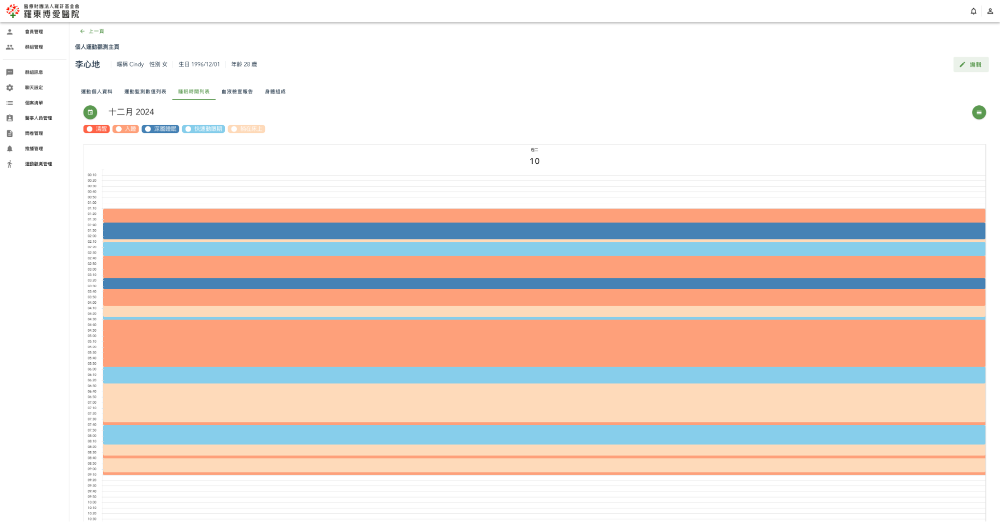

##### 運動數據觀測

使用者可於運動觀測查看個人運動數據

運動觀測主要功能：

- 連接健康app自動同步運動數據

- 手動輸入運動數據

- 查看運動趨勢圖表

- 設定運動目標

##### 連接健康app

使用者於「運動觀測」>「設定」>「連接app與裝置」點擊選擇要連接的app

- iOS健康

- Google Fit

連接後自動同步以下數據：

- 每日步數

- 運動時間

- 消耗卡路里

- 運動類型

##### 手動輸入運動數據

當無法透過健康app取得數據時，使用者可手動輸入：

- 運動日期

- 運動時間

- 運動類型（走路、跑步、騎腳踏車、游泳、其他）

- 運動持續時間（分鐘）

- 消耗卡路里（選填）

##### 運動趨勢圖表

使用者可查看運動數據趨勢：
時間區間選擇：今日、一週、一個月、三個月、半年、一年
數據類型選擇：步數、運動時間、消耗卡路里

圖表顯示：

- X軸：時間

- Y軸：對應的運動數據

##### 設定運動目標

使用者可設定個人運動目標：

- 每日步數目標

- 每週運動時間目標

- 每週消耗卡路里目標

達成目標時系統給予鼓勵訊息

##### 從HIS取得身體組成報告

使用者可查看由HIS系統提供的身體組成分析報告

- 體脂率

- 肌肉量

- 內臟脂肪

- 基礎代謝率

- 分析日期

#### 3.1.11 聊天室（第二階段）

##### 聊天功能

使用者可與醫事人員進行即時聊天

聊天室功能：

- 文字訊息傳送

- 圖片傳送

- 檔案傳送

- 語音訊息（選擇性開發）

聊天對象：

- 個管師

- 營養師

- 護理師

- 其他醫事人員

##### 訊息通知

當收到新訊息時：

- APP內通知

- 推播通知（可設定關閉）

- 聊天室紅點提示

##### 訊息管理

聊天室訊息功能：

- 訊息記錄保存

- 重要訊息標記

- 訊息搜尋功能

#### 3.1.12 衛教園地（第四階段）

##### 衛教文章瀏覽

使用者可瀏覽衛教文章

文章分類：

- 疾病衛教

- 營養衛教

- 運動衛教

- 用藥安全

- 健康生活

文章內容包含：

- 文章標題

- 發布日期

- 文章內容（文字、圖片、影片）

- 相關連結

##### 閱讀記錄

系統記錄使用者閱讀行為：

- 文章閱讀完成度

- 閱讀時間

- 是否為必讀文章

必讀文章需要閱讀完成才能標記為已讀

##### 問卷連結

部分衛教文章閱讀完成後，會提示填寫相關問卷

### 3.2 CMS 後台功能

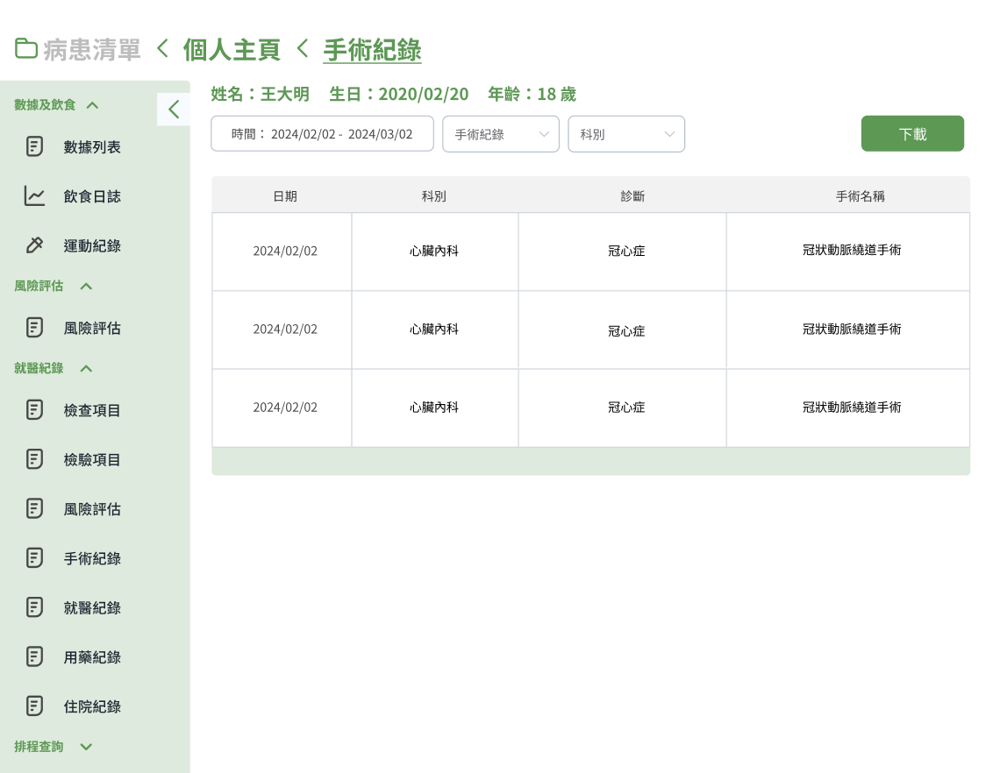

#### 3.2.1 登入（第二階段）

##### 管理員登入

管理員可透過CMS後台登入系統

登入方式：

- 帳號密碼登入

- 整合醫院現有帳號系統

權限分級：

- 超級管理員：系統最高權限

- 管理員：部分管理權限

- 醫事人員：基本操作權限

#### 3.2.2 會員管理（第一階段）

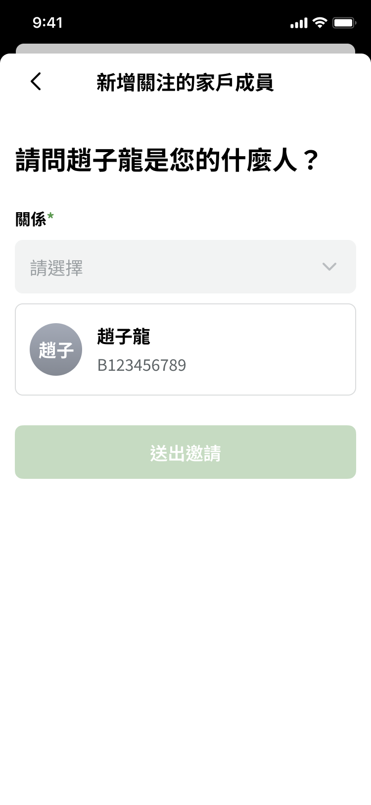

##### 會員清單

管理員可查看和管理所有註冊會員

會員清單顯示：

- 姓名

- 身分證字號

- 註冊日期

- 最後登入時間

- 帳號狀態（啟用/停用）

##### 會員搜尋

可透過以下條件搜尋會員：

- 姓名

- 身分證字號

- 手機號碼

- 註冊日期範圍

##### 會員資料編輯

管理員可編輯會員基本資料：

- 個人資料修改

- 帳號狀態變更

- 權限設定

##### 會員監測數據檢視

管理員可查看會員的監測數據：

- 自我監測記錄

- 數據趨勢圖表

- 異常數據提醒

#### 3.2.3 醫事人員管理（第二階段）

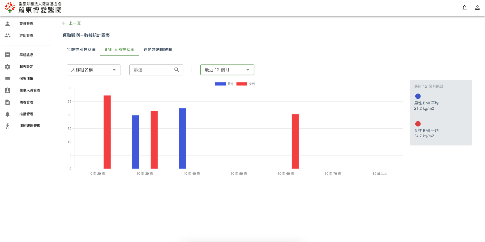

##### 醫事人員帳號管理

管理員可建立和管理醫事人員帳號

帳號建立：

- 姓名

- 員工編號

- 職別（個管師、營養師、護理師等）

- 聯絡資訊

- 權限設定

##### 權限管理

不同職別的醫事人員有不同權限：

- 會員資料檢視權限

- 聊天室使用權限

- 衛教園地管理權限

- 問卷管理權限

#### 3.2.4 群組管理（第一階段）

##### 會員群組建立

管理員可建立會員群組進行分類管理

群組類型：

- 疾病類別群組

- 風險等級群組

- 地區群組

- 自訂群組

##### 群組成員管理

群組功能：

- 新增/移除群組成員

- 群組成員清單檢視

- 批次操作功能

##### 群組訊息推送

可針對特定群組推送訊息：

- 衛教訊息

- 問卷通知

- 活動通知

#### 3.2.5 課程管理（第五階段）

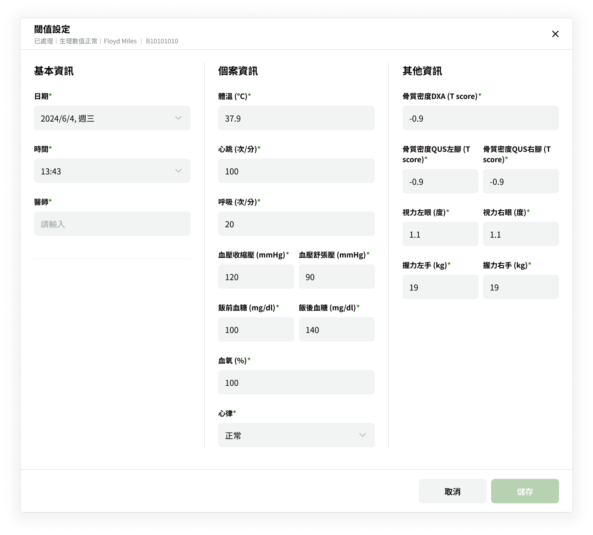

##### 課程建立

管理員可建立新課程

課程資訊包含：

- 課程名稱

- 課程描述

- 授課老師

- 課程時間

- 課程地點

- 課程費用

- 報名人數限制

##### 課程編輯

可編輯現有課程資訊：

- 基本資訊修改

- 時間異動

- 費用調整

##### 報名管理

課程報名功能：

- 報名清單檢視

- 報名狀態管理

- 退費處理

#### 3.2.6 衛教園地管理

##### 文章管理

管理員可管理衛教文章

文章功能：

- 新增文章

- 編輯文章

- 刪除文章

- 文章分類

文章內容編輯：

- 標題設定

- 內容編輯（富文本編輯器）

- 圖片上傳

- 影片嵌入

- 發布時間設定

##### 閱讀統計

可查看文章閱讀統計：

- 文章瀏覽次數

- 閱讀完成率

- 使用者閱讀記錄

#### 3.2.7 個案清單

##### 個案資料檢視

醫事人員可查看負責個案的詳細資料

個案資料包含：

- 基本資料

- 監測數據記錄

- 就醫記錄

- 風險評估結果

##### 個案狀態管理

可標記個案狀態：

- 追蹤中

- 穩定

- 需關注

- 已結案

#### 3.2.8 個人主頁

##### 個人資料設定

醫事人員可設定個人資料：

- 基本資料

- 聯絡方式

- 專長領域

- 頭像設定

##### 工作統計

顯示個人工作統計：

- 負責個案數

- 聊天室對話數

- 問卷發送數

- 衛教文章發布數

#### 3.2.9 聊天室管理（第二階段）

##### 聊天記錄管理

管理員可管理聊天室記錄

聊天室功能：

- 對話記錄檢視

- 訊息搜尋

- 重要訊息標記

##### 醫事人員指派

可指派醫事人員負責特定會員：

- 個管師指派

- 專科醫事人員指派

- 輪班制度管理

#### 3.2.10 問卷管理（第二階段）

醫事人員可於Google表單新增完問卷後，進到CMS填入連結

醫事人員於Google表單編輯完問卷後，至問卷管理後台，貼上連結及預填名稱（prefill name）、問卷標題 填寫後，可於後台查看回覆人，並且透過推播通知發送問卷

SOP請參考教學連結：[https://app.tango.us/app/workflow/---CMS--STG---------fc444a08ee5e4d2194f4ef82beff3b24](https://app.tango.us/app/workflow/---CMS--STG---------fc444a08ee5e4d2194f4ef82beff3b24)

##### 問卷回覆結果分析

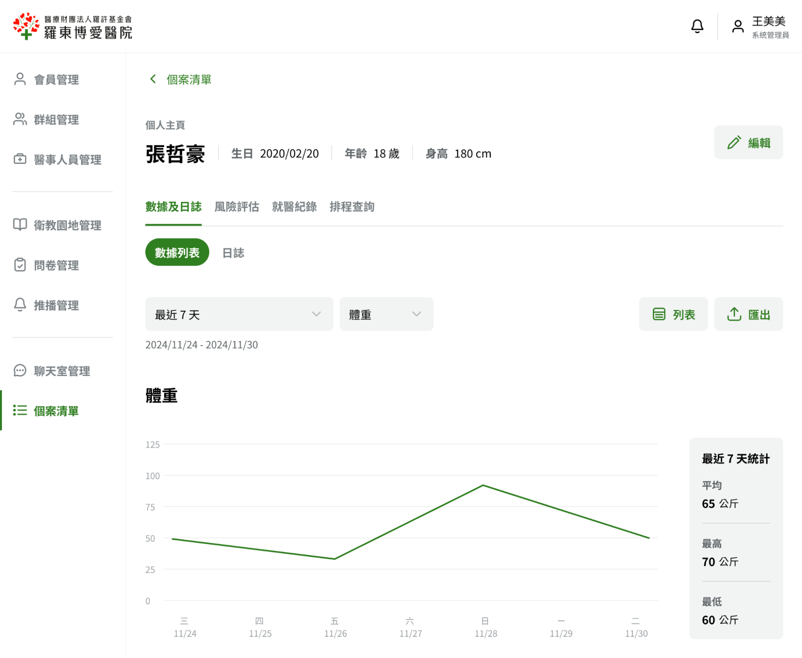

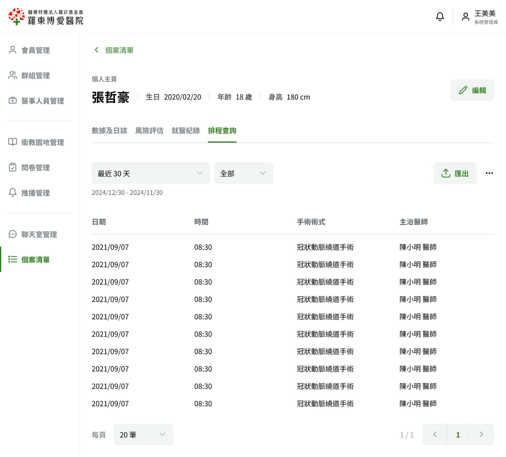

醫事人員可於後台檢視問卷回覆結果分析

醫事人員可於後台檢視個別問卷的推播及回覆狀況，包含回覆人/日期＋時間：

##### 歷史紀錄

- 推播人數

- 完成問卷人數

##### 推播名單

- 收到問卷推播的帳號名稱

- 收到問卷推播的日期時間

如需細節分析，可使用Google表單內置功能。

##### 問卷紀錄

醫事人員可於個案清單 - 點擊用戶 - 問卷紀錄，檢視該用戶曾經被推播問卷及完成的歷史，包含：

- 問卷名稱（標題）

- 發送問卷日期

- 完成問卷日期

- 結果圖表顯示

- 個別回答檢視

#### 3.2.11 推播管理（第二階段）

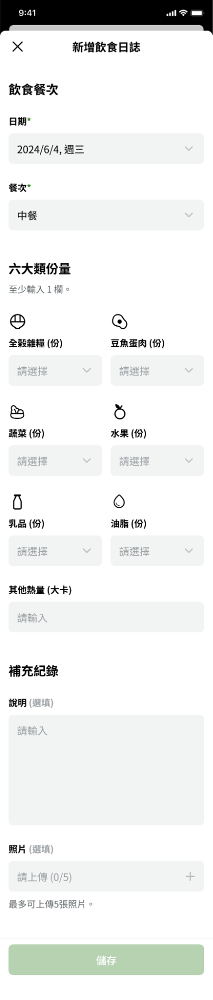

##### 推播訊息建立

管理員可建立推播訊息

推播類型：

- 一般通知

- 衛教提醒

- 問卷通知

- 緊急通知

推播設定：

- 訊息內容

- 發送時間

- 目標對象

- 重要等級

##### 推播發送記錄

可查看推播發送記錄：

- 發送時間

- 發送對象

- 送達率

- 開啟率

#### 3.2.12 運動觀測管理（第三階段）

##### 運動觀測

點擊左邊列表「運動觀測管理」進入瀏覽頁面，可篩選「群組」「帳戶ID」「大群組名稱」「小群組名稱」

可點擊右上角「查看數據統計圖表」查看平台運動相關數據統計

欄位包含：

- 姓名

- 大/小群組（可點擊查看）

- 管理員（由管理員後台新增一對一指定後台管理員，若無則留白）

- 性別（男/女）

- 帳戶ID

- 狀態（啟用/停用）

- 操作（點擊更多 > 查看、編輯、傳送訊息（跳轉聊天室）、運動觀測閾值設定）

##### 查看數據統計圖表

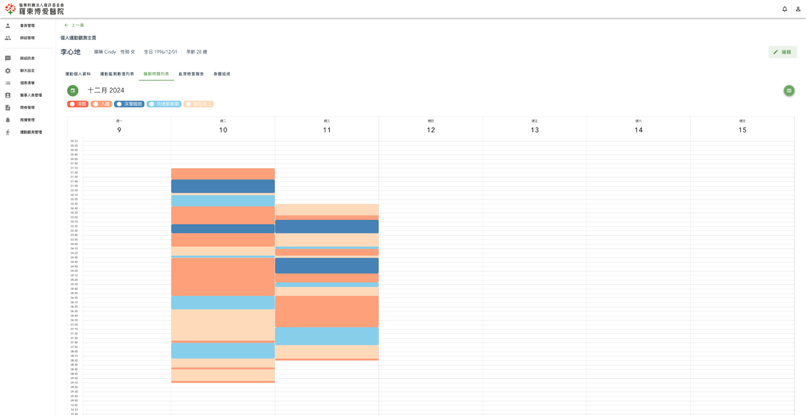
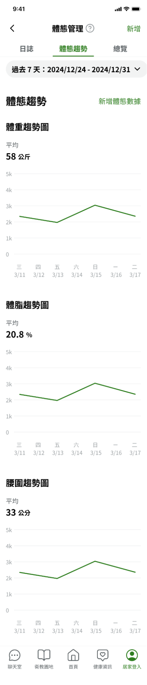

數據圖表包含圖表和平均數據：

- 年齡性別柱狀圖（時間段內註冊的會員）

- BMI分佈柱狀圖（時間內有BMI紀錄的註冊會員）

- 運動類別圓餅圖（時間內的所有運動類別紀錄/人數）

可篩選「群組」「時間」：

- 群組可篩選大群組名稱、小群組名稱

- 時間可選擇近4週、2個月、6個月、12個月

##### 編輯運動閾值

點擊會員>更多>運動觀測閾值設定，可分別編輯使用的運動紀錄閾值。

閾值欄位包含：

##### 每日運動數據

- 最低總耗能 (大卡)* （預設300大卡）

- 最低總步數 (步)*（預設4000步）

- 最低心率 (下/分鐘)*（預設40）

- 最大心率 (下/分鐘)*（預設180）

- 最低靜止心率 (下/分鐘)*（預設40）

- 最大靜止心率 (下/分鐘)*（預設180）

##### 每日睡眠時間

- 最低睡眠時數*（預設5.5小時）

- 最大睡眠時數*（預設8.5小時）

##### 身體組成目標

- 最低體重 (公斤)(選填)

- 最大體重 (公斤)(選填)

- 最大體脂 (％)* （預設：24%）

- 最低 BMI (kg/m^2)* （預設15%）

- 最大 BMI (kg/m^2)*（預設24%）

- 最低肌肉重量 (公斤)(選填)

- 最低脂肪重量 (公斤)(選填)

- 最低內臟脂肪分數 (分)*（預設4）

- 最大內臟脂肪分數 (分)*（預設8）

- 最低 SMI 指數 (kg/m^2)*（預設7）

- 最大腹圍 (公分)*（預設男90 女80）

- 最低身體健康評分 (分)*（預設80）

##### 運動個人資料

點擊「查看」顯示運動個人資料
點擊「編輯」可編輯運動個人資料（由管理員編輯，使用者無法新增編輯查看）

資料包含：

- 聯絡電話

- 緊急聯絡人

- 緊急聯絡電話

- 居住地址

- 運動疾病歷史（糖尿病、心臟病、高血壓、骨質疏鬆、有吸菸、有喝酒、其他病史）

##### 運動監測數值列表

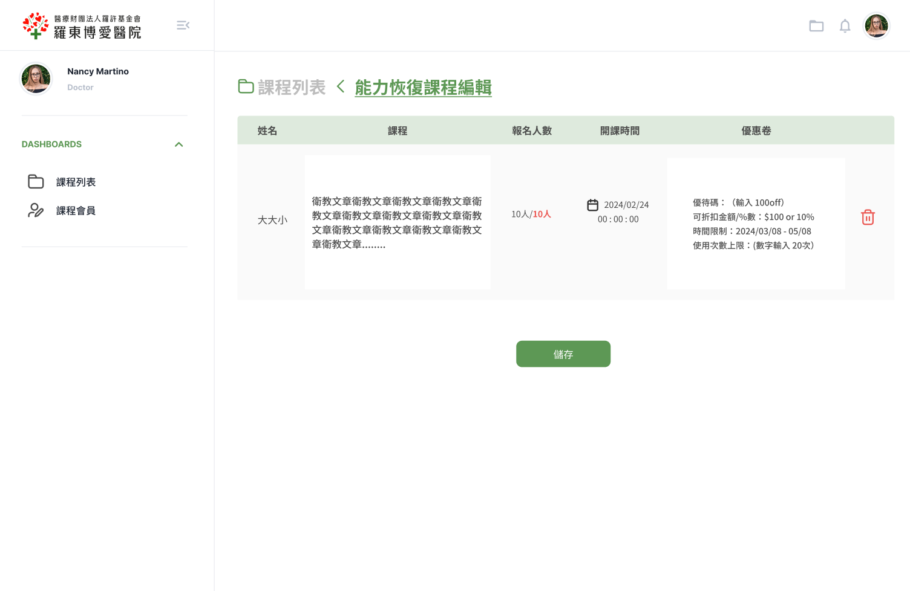

監測數值列表包含，可點擊右上角匯出（excel/pdf）：

- 日期

- 步數加總

- 活動耗能

- 運動時間

- 異常（超出閾值設定數據）

- 動作（查看當日數據及異常）

##### 睡眠時間列表

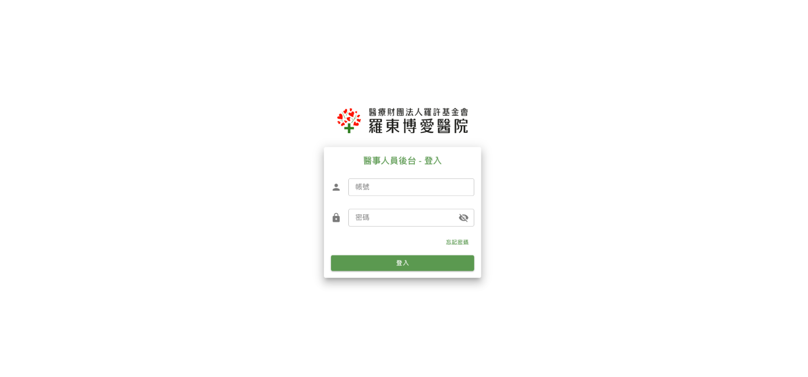
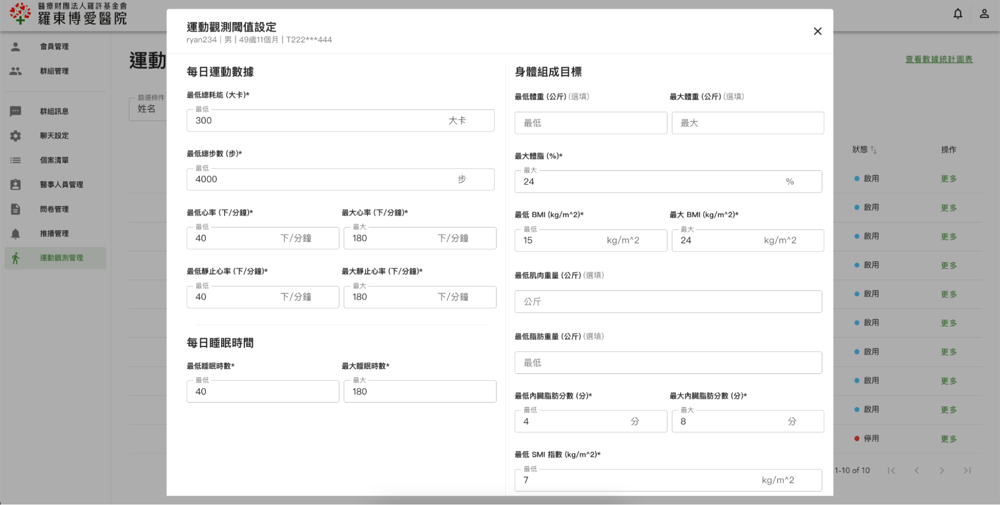

以列表方式顯示睡眠時間，點擊左上角「日曆」icon可點選日期，點擊右上角「列表顯示」可切換當日或當週數據，可點擊右上角匯出（excel/pdf）

數據顯示包含：

- 清醒

- 入睡

- 深層睡眠

- 快速動眼期

- 躺在床上

數據全來自手機同步資料，若無資料則不顯示
數據十分鐘為一區間

##### 血液檢查報告

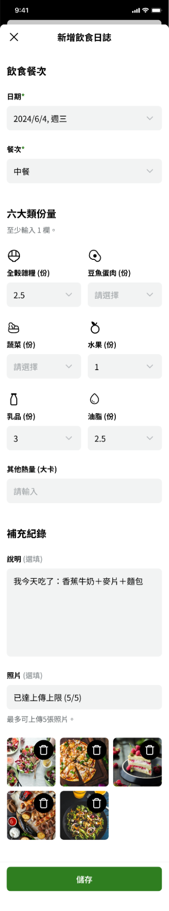

來自於博愛醫院HIS回傳資料，純顯示（無法編輯/更新/刪除）可點擊右上角匯出（excel/pdf）

報告包含：

- 日期

- 飯前血糖

- 糖化血色素

- TCHOL

- HDL

- 異常

- 動作（查看）

點擊查看後，可查看完整報告資料，包含：血液數據、數值、異常狀態（過高、過低）

##### 身體組成報告

數據欄位包含以下，可點擊右上角匯出（excel/pdf）：

- 日期

- 體重

- BMI

- 肌肉重

- 脂肪重

- 腹圍

- 異常

- 查看（點擊查看顯示完整報告數據）

---

**製作單位**: 馬在飛科技有限公司 2024/03/22  
**轉換日期**: 2025/08/17

## 4. PRD 異動記錄

| 版本 | 異動日期 | 異動類型 | 異動說明 | 異動人員 |
|------|----------|----------|----------|----------|
| v1.4 | 2025/08/17 | 內容增強 | 從原始文件精確替換詳細功能規格，包括問卷管理Google Forms整合、運動觀測閾值設定等 | Claude Code |
| v1.3 | 2025/08/17 | 結構優化 | 添加階層編號系統、錨點標記和可點擊目錄導航 | Claude Code |
| v1.2 | 2025/08/17 | 圖片整合 | 新增48張功能示意圖與界面設計圖 | Claude Code |
| v1.1 | 2025/08/17 | 格式轉換 | HTML格式轉換為Markdown格式，內容無異動 | Claude Code |
| v1.0 | 2025/07/25 | 初版建立 | 建立羅東博愛醫院APP專案委託製作內容確認書 | 馬在飛科技 |
